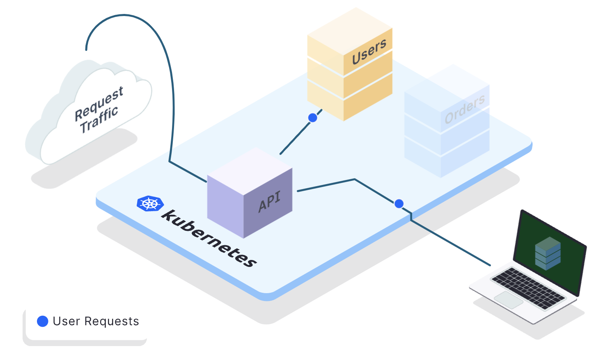
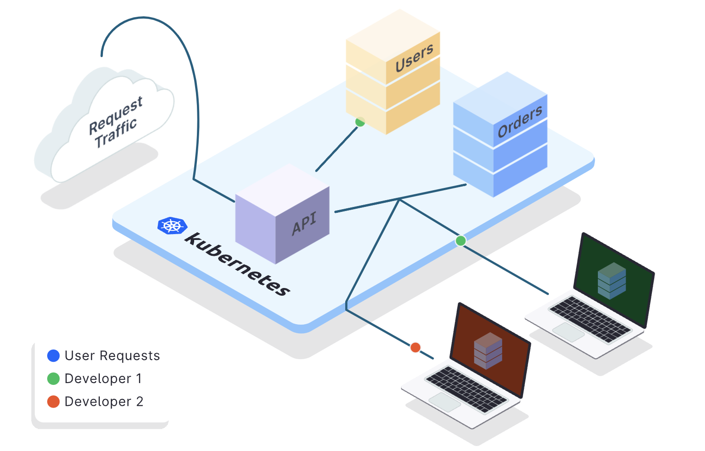
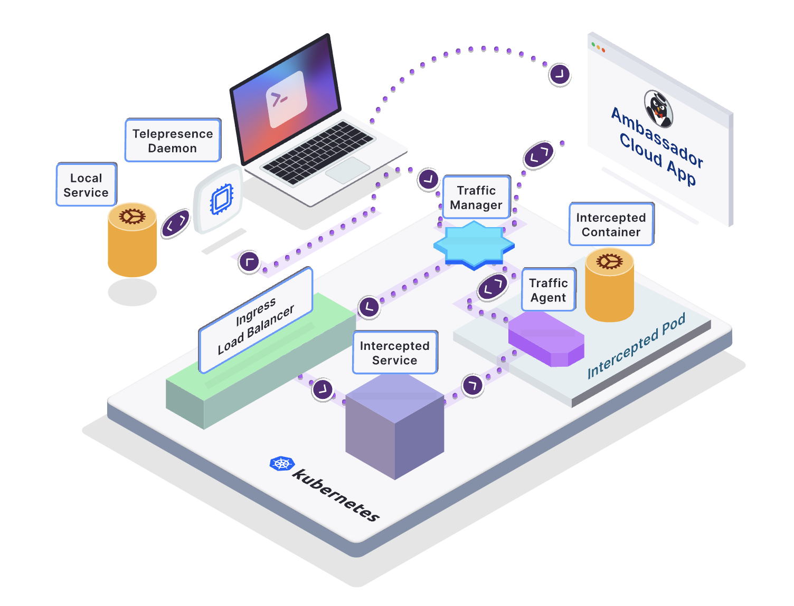

# Telepresence

See: https://www.telepresence.io/docs/latest/quick-start/

## Concept
See: https://www.getambassador.io/docs/telepresence/latest/concepts/intercepts?intercept=personal

#### `--single-user-mode`



####  `--team-mode`




## Architecture



## Installation

### Install it in a client

#### Linux

```bash
# 1. Download the latest binary (~50 MB):
sudo curl -fL https://app.getambassador.io/download/tel2/linux/amd64/latest/telepresence -o /usr/local/bin/telepresence

# 2. Make the binary executable:
sudo chmod a+x /usr/local/bin/telepresence
```

#### Mac

```bash
# Intel Mac
brew install datawire/blackbird/telepresence

# Apple Silicon
brew install datawire/blackbird/telepresence-arm64
```

### Install it in a cluster

```bash
$ telepresence helm install
# $ telepresence helm install --team-mode
# $ telepresence helm upgrade
Launching Telepresence User Daemon

Traffic Manager installed successfully
```

```bash
$ kubectl -n ambassador get po
NAME                             READY   STATUS    RESTARTS   AGE
traffic-manager-679d87fc-bkk64   1/1     Running   0          84s
```

### Use it

Intercept your service

```bash
telepresence connect \
  --context arn:aws:eks:ap-northeast-2:687974018385:cluster/aiip-dev
$ telepresence connect  # --cluster kind-kind-local
Launching Telepresence Root Daemon
Need root privileges to run: /opt/homebrew/bin/telepresence daemon-foreground ${HOME}/Library/Logs/telepresence '${HOME}/Library/Application Support/telepresence'
Password:
Connected to context kind-kind-local (https://127.0.0.1:53564)

# $ telepresence connect --context kind-kind-local
# $ telepresence connect --cluster kind-kind-local
# $ tp quit
```

```bash
$ curl -ik https://kubernetes.default
HTTP/2 403
audit-id: d6b5822c-8379-4891-a48b-ae9f86cae2f4
cache-control: no-cache, private
content-type: application/json
x-content-type-options: nosniff
x-kubernetes-pf-flowschema-uid: 5cc8870e-1eb4-4444-9d35-b6e8343d41ce
x-kubernetes-pf-prioritylevel-uid: 89dd198c-59fa-49d0-8f3c-6efdbe2ae2c6
content-length: 217
date: Sun, 02 Apr 2023 18:57:45 GMT

{
  "kind": "Status",
  "apiVersion": "v1",
  "metadata": {},
  "status": "Failure",
  "message": "forbidden: User \"system:anonymous\" cannot get path \"/\"",
  "reason": "Forbidden",
  "details": {},
  "code": 403
}
```

```bash
$ telepresence list -n default
No Workloads (Deployments, StatefulSets, or ReplicaSets)
```

```bash
$ telepresence status
User Daemon: Running
  Version           : v2.12.1
  Executable        : /opt/homebrew/bin/telepresence
  Install ID        : 89d7b636-e926-4368-a7ed-18aca99c6dd1
  Status            : Connected
  Kubernetes server : https://127.0.0.1:53564
  Kubernetes context: kind-kind-local
  Manager namespace : ambassador
  Intercepts        : 1 total
    fastapi-demo-default: a09255@pydemia-sk-mac
Root Daemon: Running
  Version    : v2.12.1
  Version    : v2.12.1
  DNS        : 
    Remote IP       : 127.0.0.1
    Exclude suffixes: [.com .io .net .org .ru]
    Include suffixes: []
    Timeout         : 8s
  Also Proxy : (0 subnets)
  Never Proxy: (1 subnets)
    - 127.0.0.1/32
Ambassador Cloud:
  Status      : Logged out
Traffic Manager: Connected
  Version : v2.12.1
  Mode    : single-user
Intercept Spec: Not running
```


```bash
$ kubectl apply -f python/deployment.yaml
deployment.apps/fastapi-demo created
service/fastapi-demo created
```

```bash
$ telepresence list
fastapi-demo: ready to intercept (traffic-agent not yet installed)
```

```console
telepresence intercept \
  <service-name> \
  --port <local-port>[:<remote-port>] \
  --env-file <path-to-env-file>
```

* `--env-file`
* Docker: enter docker run and provide the path to the file using the --env-file argument. For more information about Docker run commands, see the Docker command-line reference documentation.
* Visual Studio Code: specify the path to the environment variables file in the envFile field of your configuration.
* JetBrains IDE (IntelliJ, WebStorm, PyCharm, GoLand, etc.): use the EnvFile plugin.

See: https://www.getambassador.io/docs/telepresence/latest/reference/environment#telepresence-environment-variables

> `TELEPRESENCE_ROOT`
> Directory where all remote volumes mounts are rooted. See Volume Mounts for more info.
> 
> `TELEPRESENCE_MOUNTS`
> Colon separated list of remotely mounted directories.
> 
> `TELEPRESENCE_CONTAINER`
> The name of the intercepted container. Useful when a pod has several containers, and you want to know which one that was intercepted by Telepresence.
> 
> `TELEPRESENCE_INTERCEPT_ID`
> ID of the intercept (same as the "x-intercept-id" http header).
> 
> Useful if you need special behavior when intercepting a pod. One example might be when dealing with pub/sub systems like Kafka, where all processes that don't have the `TELEPRESENCE_INTERCEPT_ID` set can filter out all messages that contain an `x-intercept-id` header, while those that do, instead filter based on a matching x-intercept-id header. This is to assure that messages belonging to a certain intercept always are consumed by the intercepting process.

```bash
telepresence intercept \
  -n default \
  fastapi-demo \
  --port 8000:8000 \
  --env-file fastapi-telepresence.env

telepresence intercept \
  -n default \
  fastapi-demo \
  --port 18000:8000 \
  --mount=false \
  --env-file fastapi-telepresence.env

telepresence intercept \
  -n default \
  fastapi-demo \
  --service fastapi-demo \
  --port 18000:8000 \
  --mount=/tmp/ \
  --env-file fastapi-telepresence.env
```

```bash
$ telepresence list
fastapi-demo: intercepted
   Intercept name: fastapi-demo-default
   State         : ACTIVE
   Workload kind : Deployment
   Destination   : 127.0.0.1:18000
   Intercepting  : all TCP requests
```

```bash
curl fastapi-demo:8000 \
  -H 'x-telepresence-intercept-id: 5f12ef1f-c2d1-481c-8de3-3db738b93d58:fastapi-demo-default'
```

```bash
$ telepresence leave fastapi-demo-default
```

and more:

* [Client-side config](https://www.getambassador.io/docs/telepresence/latest/reference/config)
* [Server-side config](https://www.getambassador.io/docs/telepresence/latest/reference/cluster-config)
* [Using Docker for intercept](https://www.getambassador.io/docs/telepresence/latest/reference/docker-run#using-docker-for-intercepts)
* [Official Docs](https://www.getambassador.io/docs/telepresence)

